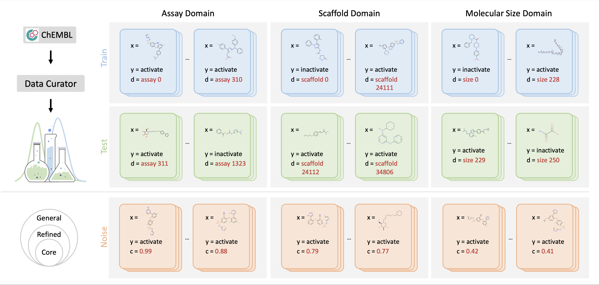
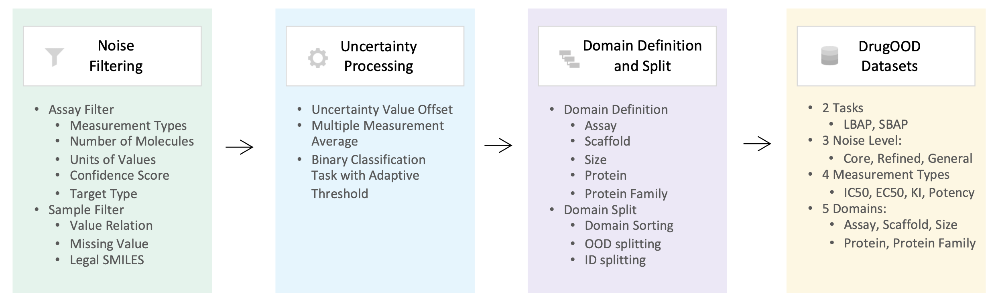
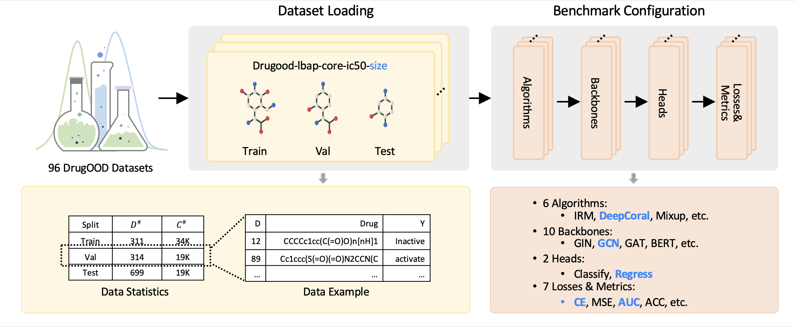

## DrugOOD: OOD Dataset Curator and Benchmark for AI-aided Drug Discovery

### News

- 2023: DrugOOD will be presented at AAAI 2023.  

- 2022:  We have released 96 realized exemplar datasets based on the DrugOOD curator. They can be downloaded from <https://drive.google.com/drive/folders/19EAVkhJg0AgMx7X-bXGOhD4ENLfxJMWC>

- July 2022:  DrugOOD is presented at the ["DataPerf Workshop at ICML 2022"](https://sites.google.com/view/dataperf2022/home?authuser=0)

### Project Description

AI-aided drug discovery (AIDD) is gaining increasing popularity due to its promise of  making  the  search  for  new   pharmaceuticals  quicker,  cheaper  and  more  efficient.  Inspite of its extensive use in many fields,  such as ADMET prediction,  virtual screening, protein folding and generative chemistry, little has been explored in terms of the out-of-distribution (OOD) learning problem with _noise_, which is inevitable in real world AIDD applications.

In this work, we present DrugOOD, a systematic OOD dataset curator and benchmark for AI-aided drug discovery,  which comes with an open-source Python package that fully automates the data curation and OOD benchmarking processes.  We focus on one of the most crucial problems in AIDD: drug target binding affinity prediction, which involves both macromolecule (protein target) and small-molecule (drug compound).  In contrast to only providing fixed datasets, DrugOOD offers automated dataset curator with user-friendly customization scripts, rich domain annotations aligned with biochemistry knowledge,  realistic  noise  annotations  and  rigorous  benchmarking  of  state-of-the-art OOD algorithms.  Since the molecular data is often modeled as irregular graphs using graph neural network (GNN) backbones, DrugOOD also serves as a valuable testbed for _graph OOD learning_ problems.  Extensive empirical studies have shown a significant performance gap between in-distribution and out-of-distribution experiments, which highlights the need to develop better schemes that can allow for OOD generalization under noise for AIDD.

`Keywords`: AI-aided drug discovery (AIDD), graph OOD learning, OOD generalization, learning under noise, binding affinity prediction, drug-target interaction, virtual screening

### Dataset Curator

DrugOOD provides large-scale, realistic, and diverse datasets for Drug AI OOD research. Specifically, DrugOOD focuses on the problem of domain generalization, in which we train and test the model on disjoint domains, e.g., molecules in a new assay environment.
Top Left: Based on the ChEMBL database, we present an automated dataset curator for customizing OOD datasets flexibly.
Top Right: DrugOOD releases realized exemplar datasets spanning different domain shifts. In each dataset, each data sample $(x, y, d)$ is associated with a domain annotation d. We use the background colours lightblue and   green  to denote the seen data and unseen test data.
Bottom: Examples with different noise levels from the DrugOOD dataset. DrugOOD identifies and annotates three noise levels (left to right: core, refined, general) according to several criteria, and as the level increases,  data volume increases and  more noisy sources are involved.

We construct all the datasets based on ChEMBL, which is a large-scale, open-access drug discovery database that aims to capture medicinal chemistry dataand knowledge across the pharmaceutical research and development process. We use thelatest release in the SQLite format:  ChEMBL 29.  Moreover,  we consider the setting of OOD and different noise levels, which is an inevitable problem when the machine learning  model  is  applied  to  the  drug  development  process.For  example,  when  predicting SBAP bioactivity in practice, the target protein used in the model inference could be very different from that in the training set and even does not belong to the same protein family. The real-world domain gap will invoke challenges to the accuracy of the model.  On the other  hand,  the  data  used  in  the  wild  often  have  various  kinds  of  noise,  e.g.   activities measured through experiments often have different confidence levels and different “cut-off” noise.  Therefore, it is necessary to construct data sets with varying levels of noise inorder to better align with the real scenarios.

Overview of the automated dataset curator is shown above. We mainly implement three major steps based on the ChEMBL data source: noise filtering, uncertainty processing, and domain splitting. We have built-in 96 configuration files to generate the realized  datasets with the configuration of two tasks, three noise levels, four measurement types, and five domains.

### Benchmarking

DrugOOD conducts a comprehensive benchmark for developing and evaluating OOD generalization algorithms for AIDD. After loading any of the datasets generated by the data curator, users can flexibly combine different types of modules, including algorithms, backbones, etc., to develop OOD generalization algorithms in a flexible and disciplined manner.

### Experiments

Baseline results on  dataset drugood-sbap-core-ic50-protein for the six OOD algorithm is shown below.
In-distribution (ID) results correspond to the train-to-train setting. Parentheses show standard deviation across 3 replicates.

 | Algos | Val(ID)-ACC | Val(ID)-ACU | Val(OOD)-ACC |Val(OOD)-AUC | Test(ID)-ACC |Test(ID)-AUC| Test(OOD)-ACC | Test(OOD)-AUC|
 | ------ | ------     | --------- |    ----------- | ------------| -------------|------------|---------------|---------------|
|ERM| 88.92 (0.24)|89.62 (1.49)|85.74 (0.24)|72.26 (0.85)|89.23 (0.30)|90.32 (1.49)|83.04 (0.25)|68.62 (0.45)|
|IRM| 88.77 (0.40)|90.63 (0.60)|85.87 (0.17)|73.28 (0.21)|89.07 (0.38)|91.29 (0.52)|82.58 (0.02)|67.66 (1.25)|
|DeepCoral|89.03 (0.35)|89.62 (1.78)|85.88 (0.34)|71.71 (1.33)|89.16 (0.40)|90.33 (1.73)|82.87 (0.52)|67.26 (1.45)|
|DANN|88.33 (0.07)|77.53 (2.15)|85.65 (0.01)|63.61 (0.57)|88.53 (0.06)|78.12 (2.25)|83.96 (0.08)|62.58 (2.03)|
|Mixup|89.14 (0.30)|90.41 (1.29)|85.99 (0.11)|71.06 (1.36)|89.36 (0.22)|91.11 (1.34)|83.09 (0.14)|68.25 (0.29)|
|GroupDro|88.73 (0.12)|88.51 (0.64)|85.37 (0.45)|72.95 (0.77)|89.06 (0.11)|89.36 (0.91)|82.26 (0.92)|67.62 (1.37)|

Baseline results on  dataset drugood-sbap-refined-ic50-protein for the six OOD algorithm is shown below.

 | Algos | Val(ID)-ACC | Val(ID)-ACU | Val(OOD)-ACC |Val(OOD)-AUC | Test(ID)-ACC |Test(ID)-AUC| Test(OOD)-ACC | Test(OOD)-AUC|
 | ------ | ------     | --------- |    ----------- | ------------| -------------|------------|---------------|---------------|
|ERM| 91.86 (0.04)|82.87 (1.88)|85.48 (0.03)|73.53 (0.74)|91.91 (0.04)|82.92 (1.86)|83.86 (0.21)|68.00 (1.35)|
|IRM| 91.86 (0.02)|80.69 (2.87)|85.49 (0.03)|73.46 (1.18)|91.85 (0.04)|81.16 (2.70)|83.74 (0.32)|67.91 (1.32)|
|DeepCoral|91.79 (0.12)|82.33 (1.51)|85.51 (0.03)|73.53 (0.44)|91.84 (0.12)|82.57 (1.28)|84.01 (0.13)|68.76 (0.21)|
|DANN|91.87 (0.01)|76.15 (2.78)|85.52 (0.02)|69.56 (1.69)|91.88 (0.01)|76.65 (2.65)|83.92 (0.30)|64.54 (1.82)|
|Mixup|91.92 (0.07)|86.02 (0.47)|85.58 (0.03)|74.22 (0.17)|91.91 (0.07)|86.23 (0.33)|83.87 (0.09)|68.70 (0.46)|
|GroupDro|91.90 (0.04)|82.65 (2.66)|85.44 (0.06)|73.63 (1.22)|91.92 (0.03)|82.94 (2.66)|83.88 (0.16)|68.41 (0.83)|

Baseline results on  dataset drugood-sbap-general-ic50-protein for the six OOD algorithm is shown below.

 | Algos | Val(ID)-ACC | Val(ID)-ACU | Val(OOD)-ACC |Val(OOD)-AUC | Test(ID)-ACC |Test(ID)-AUC| Test(OOD)-ACC | Test(OOD)-AUC|
 | ------ | ------     | --------- |    ----------- | ------------| -------------|------------|---------------|---------------|
|ERM| 90.90 (0.02)|78.97 (1.86)|86.16 (0.08)|71.63 (0.48)|90.88 (0.02)|78.94 (1.90)|81.98 (0.15)|68.06 (0.31)|
|IRM| 90.84 (0.02)|78.32 (2.52)|86.17 (0.04)|70.81 (1.56)|90.80 (0.02)|78.05 (3.04)|82.07 (0.05)|67.13 (1.18)|
|DeepCoral|90.92 (0.01)|78.00 (1.91)|86.27 (0.04)|70.74 (0.76)|90.88 (0.03)|77.81 (2.13)|82.17 (0.07)|67.20 (0.60)|
|DANN|90.95 (0.00)|66.59 (7.90)|86.30 (0.00)|63.79 (5.72)|90.91 (0.00)|66.39 (7.70)|82.28 (0.01)|61.55 (5.13)|
|Mixup|90.90 (0.02)|77.55 (1.77)|86.22 (0.05)|70.68 (1.66)|90.88 (0.03)|77.31 (2.06)|82.04 (0.11)|67.84 (0.66)|
|GroupDro|90.85 (0.07)|79.71 (1.50)|86.16 (0.02)|71.98 (0.45)|90.82 (0.08)|79.69 (1.50)|82.04 (0.02)|68.04 (0.33)|

### Code and Datasets

- Code:   <https://github.com/tencent-ailab/DrugOOD>

- 96 realized datasets: <https://drive.google.com/drive/folders/19EAVkhJg0AgMx7X-bXGOhD4ENLfxJMWC>

### Paper

Preprint: <https://arxiv.org/abs/2201.09637>

### Contact

Email: <DrugAIOOD@gmail.com>

